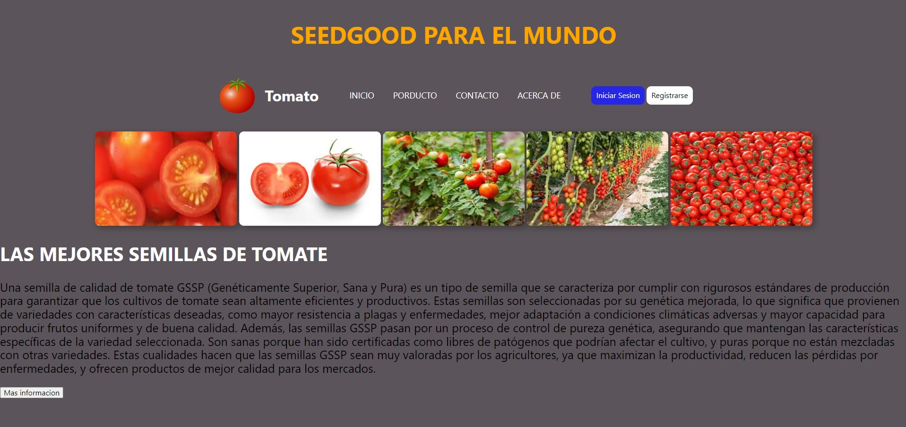

# TAREA

_A partir de tu proyecto de la semana 06, aplica el Responsive a tu pagina web para que pueda ser visualizado en celular, tablets, laptops, etc._
 
_Para tener un orden, tu proyecto deberá estar en un nuevo repositorio. Además de crear un readme explicando el uso de las propiedades que has utilizado en tu pagina web, como adicional a esto en el propio readme adjuntar captura de pantalla de la pagina._
___

## EXPLICACION
Se a utilizado las media queries

- *@media condición*	Si se cumple la condición, se aplican los estilos de su interior.
- *@media not condición*	Si no se cumple la condición, se aplican los estilos de su interior.

## IMAGENES
-   *PAGINA PRINCIPAL DE PAGINA WEB INICIAL*
- VISTA DE  LAPTOP

-VISTA DE TABLET

-VISTA DE CELULAR

